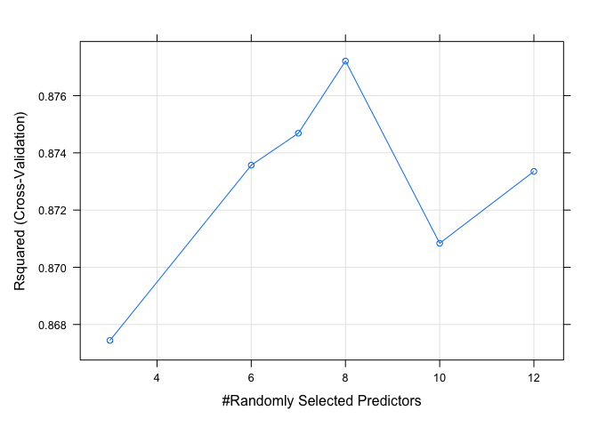

260Website
================
2022-12-06

# Introduction

The goal of this project is to use various input features to predict the
price of a house in Boston. The dataset was from a research paper titled
“Hedonic prices and the demand for clean air” which was authored by
David Harrison and Daniel L. Rubenfield in 1978.

The dataset has 506 observations of 13 predictors with the output being
the median value of owner-occupied homes in \$1000s.

### Feature Description

1)  CRIM: per capita crime rate by town<br>
2)  ZN: proportion of residential land zoned for lots over 25,000
    sq.ft.<br>
3)  INDUS: proportion of non-retail business acres per town<br>
4)  CHAS: Charles River dummy variable (1 if tract bounds river; 0
    otherwise)<br>
5)  NOX: nitric oxides concentration (parts per 10 million)
    \[parts/10M\]<br>
6)  RM: average number of rooms per dwelling<br>
7)  AGE: proportion of owner-occupied units built prior to 1940<br>
8)  DIS: weighted distances to five Boston employment centres<br>
9)  RAD: index of accessibility to radial highways<br>
10) TAX: full-value property-tax rate per $10,000 [$/10k\]<br>
11) PTRATIO: pupil-teacher ratio by town<br>
12) B: The result of the equation B=1000(Bk - 0.63)^2 where Bk is the
    proportion of black people by town<br>
13) LSTAT: % lower status of the population

``` r
dat <- read.csv("boston.csv")
head(dat)
```

    ##      CRIM ZN INDUS CHAS   NOX    RM  AGE    DIS RAD TAX PTRATIO      B LSTAT
    ## 1 0.00632 18  2.31    0 0.538 6.575 65.2 4.0900   1 296    15.3 396.90  4.98
    ## 2 0.02731  0  7.07    0 0.469 6.421 78.9 4.9671   2 242    17.8 396.90  9.14
    ## 3 0.02729  0  7.07    0 0.469 7.185 61.1 4.9671   2 242    17.8 392.83  4.03
    ## 4 0.03237  0  2.18    0 0.458 6.998 45.8 6.0622   3 222    18.7 394.63  2.94
    ## 5 0.06905  0  2.18    0 0.458 7.147 54.2 6.0622   3 222    18.7 396.90  5.33
    ## 6 0.02985  0  2.18    0 0.458 6.430 58.7 6.0622   3 222    18.7 394.12  5.21
    ##   MEDV
    ## 1 24.0
    ## 2 21.6
    ## 3 34.7
    ## 4 33.4
    ## 5 36.2
    ## 6 28.7

### Exploratory Data Analysis

To better understand the dataset and build a prediction model, I
performed some exploratory data analysis.

``` r
dat <- read.csv("boston.csv")
dat.cor <- cor(dat)
corrplot(dat.cor,        
         method = "shade", 
         type = "full",     
         diag = TRUE,       
         tl.col = "black", 
         bg = "white",     
         col = NULL)
```

<!-- -->

In the first plot, which is a correlation matrix, we can see which
predictors are most correlated with the desired output. The darker the
color, the stronger the correlation. Some significant covariates include
RM (average number of rooms per house) and LSTAT (% of the population
that’s lower status).

``` r
dat |>
  gather(-MEDV, key = "var", value = "value") |>
  ggplot(aes(x = value, y = MEDV)) +
  geom_point() +
  geom_smooth(method = 'lm') +
  facet_wrap(~ var, scales = "free") +
  ylab('Price')
```

    ## `geom_smooth()` using formula = 'y ~ x'

<!-- -->

In the second EDA plot, I plotted every variable in a facet plot to
better understand the positive, negative, or even insignificant linear
relationship each variable has with the house price. Additionally, I can
get a sense of the data distribution for each predictor. For example,
it’s clear from this plot that CHAS (the location in relation to the
Charles River) is binary and therefore, should be adjusted for
accordingly when building the models.

Based on the largely continuous data and the continuous outcome in the
dataset, I decided to use two predictive models we’ve learned this
semester: multivariate linear regression and random forest.
Additionally, I will be using k-fold cross validation to prevent
overfitting and to evaluate the performance of my models. For both
models, I will be using the R-squared value to compare prediction
accuracy. I believe the comparison of a parametric and non-parametric
model on the same dataset will be interesting insight.

# Results

In order to perform the k-fold cross validation and also measure how
well it is able to create predictions on unseen data, I first split my
dataset randomly into 80% that would be fed into the cross-validation
and create a cross-validated model. Then, I used the 20% I held out from
the cross validation to use as unseen data to test the cross-validated
model’s predictive performance. Therefore, 404 of the 506 observations
were used randomly chosen to be used when cross-validation and the
remaining 102 observations were used to make new predictions. There is
not reason for my splitting of the data using an 80/20 split because I
am not splitting my data with the same purpose as a traditional 80/20
train-test split. Instead, I wanted to ensure that I could allocate
enough data for my cross-validated model while still having enough
“unseen” data for my eventual model evaluation.

Additionally, based on the initial exploratory data analysis where I
found that the CHAS variable was binary, I used the as.factor() tranform
it before using it for modeling.

``` r
set.seed(1)
dat <- read.csv("boston.csv")
split <- sample(1:nrow(dat), floor(0.8*nrow(dat)))

#cv dataset
old <- dat[split,]
old$CHAS <- as.factor(old$CHAS)

#held-out dataset
new <- dat[-split,]
new$CHAS <- as.factor(new$CHAS)
```

To create the held-out dataset which I will use for evaluation, I split
the dataset and took away the 14th column to save it as the results
column. In doing so, my model will be able to create predictions
objectively without influence from the actual MEDV observations.
Therefore, when testing the cross-validated model, I only input columns
1 to 13 which were the predictors.

``` r
new_true <- new[14]
new_true_vector <- new_true[['MEDV']]
new_dat <- new[1:13]
```

### Linear Regression

The first model I built was a multivariate linear regression model using
k-fold cross validation. To begin, I fit a linear model on the data and
analyzed the model summary. It’s important to note from this initial
model summary which variables are statistically significant and provide
the most predictive power. We can see that variables such as LSTAT and
RM are extremely statistically significant and these findings also align
with our initial data analysis.

``` r
mod1 <- lm(MEDV ~ ., data = old)
summary(mod1)
```

    ## 
    ## Call:
    ## lm(formula = MEDV ~ ., data = old)
    ## 
    ## Residuals:
    ##      Min       1Q   Median       3Q      Max 
    ## -11.3346  -2.8069  -0.6893   1.8473  25.8640 
    ## 
    ## Coefficients:
    ##               Estimate Std. Error t value Pr(>|t|)    
    ## (Intercept)  32.409784   6.062835   5.346 1.54e-07 ***
    ## CRIM         -0.094209   0.041856  -2.251 0.024954 *  
    ## ZN            0.040461   0.015676   2.581 0.010212 *  
    ## INDUS         0.029975   0.069521   0.431 0.666582    
    ## CHAS1         3.145406   0.971045   3.239 0.001301 ** 
    ## NOX         -14.948362   4.417643  -3.384 0.000787 ***
    ## RM            4.072640   0.487860   8.348 1.22e-15 ***
    ## AGE          -0.004984   0.015085  -0.330 0.741255    
    ## DIS          -1.435179   0.233561  -6.145 1.98e-09 ***
    ## RAD           0.322335   0.073795   4.368 1.61e-05 ***
    ## TAX          -0.013216   0.004153  -3.182 0.001579 ** 
    ## PTRATIO      -0.884185   0.154686  -5.716 2.17e-08 ***
    ## B             0.010581   0.003070   3.446 0.000631 ***
    ## LSTAT        -0.552032   0.057237  -9.645  < 2e-16 ***
    ## ---
    ## Signif. codes:  0 '***' 0.001 '**' 0.01 '*' 0.05 '.' 0.1 ' ' 1
    ## 
    ## Residual standard error: 4.912 on 390 degrees of freedom
    ## Multiple R-squared:  0.7412, Adjusted R-squared:  0.7326 
    ## F-statistic: 85.92 on 13 and 390 DF,  p-value: < 2.2e-16

I then began to build my predictive model using the Caret package and
the trainControl() function to specify the number of folds. An important
aspect of cross-validation I experimented with was whether the number of
folds in cross validation significantly impacted the model’s predictive
performance. To better understand this, I plotted the overall r-squared
value of the cross validated linear regression model based on different
numbers of folds.

``` r
columns = c("k", "rsquared")
test <- data.frame(matrix(nrow = 1, ncol = length(columns))) 
colnames(test) = columns
for(i in 2:35){
  new <- rep(i, ncol(test))                      
  test[nrow(test) + 1, ] <- new  
  ctrl <- trainControl(method = "cv", number = i)
  model <- train(MEDV ~ ., data = old, method = "lm", trControl = ctrl)
  test$k[i] <- i
  test$rsquared[i] <- model$results[1,3]
}
ggplot(data=test, aes(x=k, y=rsquared)) +
  geom_line()+
  geom_point()+ggtitle("Linear Regression")
```

    ## Warning: Removed 1 row containing missing values (`geom_line()`).

    ## Warning: Removed 1 rows containing missing values (`geom_point()`).

<!-- -->

As we can see from the plot, overall, there’s an upwards trend where as
k increases, so does the model’s overall r-squared value. However, we
can see there’s also a lot of variation between points. In the end, I
chose to use 10-fold cross validation for my linear regression model
because its performance seemed consistent. After creating a
cross-validated model using the code below, we can, once again, print
the model summary which overall performance of the model, given its
performance on each fold.

``` r
ctrl_lm <- trainControl(method = "cv", number = 10)
model_lm <- train(MEDV ~ ., data = old, method = "lm", trControl = ctrl_lm)
print(model_lm)
```

    ## Linear Regression 
    ## 
    ## 404 samples
    ##  13 predictor
    ## 
    ## No pre-processing
    ## Resampling: Cross-Validated (10 fold) 
    ## Summary of sample sizes: 364, 363, 363, 364, 364, 364, ... 
    ## Resampling results:
    ## 
    ##   RMSE      Rsquared   MAE     
    ##   4.969376  0.7359873  3.515424
    ## 
    ## Tuning parameter 'intercept' was held constant at a value of TRUE

The overall r-squared value for this model was 0.753. We can dive even
further by looking at the individual metrics of each fold.

``` r
print(model_lm$resample) 
```

    ##        RMSE  Rsquared      MAE Resample
    ## 1  4.547991 0.7429570 3.522612   Fold01
    ## 2  4.704179 0.7232006 3.360172   Fold02
    ## 3  4.969463 0.7407737 3.912239   Fold03
    ## 4  4.430434 0.7845323 3.362821   Fold04
    ## 5  7.713476 0.5015428 4.285015   Fold05
    ## 6  4.082940 0.7562486 3.439726   Fold06
    ## 7  5.514434 0.7284347 3.876911   Fold07
    ## 8  5.239584 0.8332903 3.329776   Fold08
    ## 9  3.382829 0.8633415 2.593854   Fold09
    ## 10 5.108426 0.6855515 3.471112   Fold10

As we can see, while each fold’s performance varies slightly, they
average out to 0.753. The final model’s coefficient and intercept
estimates after cross validation are:

``` r
print(model_lm$finalModel)
```

    ## 
    ## Call:
    ## lm(formula = .outcome ~ ., data = dat)
    ## 
    ## Coefficients:
    ## (Intercept)         CRIM           ZN        INDUS        CHAS1          NOX  
    ##   32.409784    -0.094209     0.040461     0.029975     3.145406   -14.948362  
    ##          RM          AGE          DIS          RAD          TAX      PTRATIO  
    ##    4.072640    -0.004984    -1.435179     0.322335    -0.013216    -0.884185  
    ##           B        LSTAT  
    ##    0.010581    -0.552032

I then moved on to generating new predictions on unseen data using this
cross-validated model using the predict() function. This allows me to
calculate the model’s r-squared value by comparing the predicted house
prices with the actual observed house prices.

``` r
new_prediction <- predict(model_lm, newdata=new_dat)
new_prediction <- as.numeric(new_prediction)
new_true <- as.numeric(new_true_vector)

cor(new_true, new_prediction)^2 
```

    ## [1] 0.7391081

The final r-squared value for the predictions was 0.760 which is very
close to the r-squared value from the cross-validation.

### Random Forest

My next method was using a non-parametric model, random forest. Although
there are some cases when a linear regression can outperform a random
forest such as when the underlying function is truly linear, I believed
that random forest would probably outperform the linear regression model
in this project based on my prior experience and knowledge. The benefit
of a random forest is that it’s robust to outliers and nonlinear data
while also able to handle unbalanced data. Additionally, because random
forests are an ensemble machine learning algorithm and averages the
decision trees, random forests have low bias and moderate variance.

``` r
dat |>
  gather() |> 
  ggplot(aes(value)) +
  facet_wrap(~ key, scales = "free") +
  geom_histogram(bins = 30)
```

<!-- -->

Here, I plotted the distribution of each covariate and their count. The
plot shows that some variables such as RM (number of rooms) are
relatively normal distributed. However, other distributions are skewed
and such as RAD (accessibility to radial highways). . Unlike the cross
validation for linear model, the cross validation for random forest
actually selects the final model by outputting the most optimal mtry
which is the number of variables to randomly sample as candidates at
each split. I experimented with the number of folds and saw the best
r-squared at 5 folds. Additionally, I set the tunelength to be 10 in my
train() function to observe how the number of variables randomly sampled
as candidates at each split can impact the model’s performance.

``` r
set.seed(1)
control <- trainControl(method='cv', 
                        number=5, 
                        search = 'random')
rf_random <- train(MEDV ~ .,
                   data = old,
                   method = 'rf',
                   metric = 'Rsquared',
                   tuneLength  = 10, 
                   trControl = control)
print(rf_random)
```

    ## Random Forest 
    ## 
    ## 404 samples
    ##  13 predictor
    ## 
    ## No pre-processing
    ## Resampling: Cross-Validated (5 fold) 
    ## Summary of sample sizes: 324, 324, 324, 322, 322 
    ## Resampling results across tuning parameters:
    ## 
    ##   mtry  RMSE      Rsquared   MAE     
    ##    1    4.624844  0.8076747  3.139660
    ##    2    3.703571  0.8634455  2.504889
    ##    3    3.437355  0.8781125  2.318403
    ##    7    3.266543  0.8819451  2.201345
    ##   11    3.338010  0.8747898  2.230320
    ##   13    3.411574  0.8691184  2.253432
    ## 
    ## Rsquared was used to select the optimal model using the largest value.
    ## The final value used for the model was mtry = 7.

We can see from the plot below that the r-squared value peaks at a
little above 0.88 when mtry = 4 and then begins to slowly decline as
mtry increases.

``` r
plot(rf_random)
```

<!-- -->

Therefore, my final model after cross validation uses 4 randomly select
predictors. Furthermore, we can look at each fold’s performance in the
final random forest model.

``` r
rf_random$resample
```

    ##       RMSE  Rsquared      MAE Resample
    ## 1 2.772828 0.8977812 2.073122    Fold1
    ## 2 2.353065 0.9398164 1.917955    Fold2
    ## 3 4.972422 0.7542459 2.619962    Fold3
    ## 4 3.473756 0.9070017 2.342755    Fold4
    ## 5 2.760643 0.9108804 2.052932    Fold5

Finally, we can use this final cross-validated random forest model on
the held-out data to generate new house price predictions. Comparing the
true observed values with the predicted values, the model’s final
r-squared value was 0.932, almost 20% better than the linear model’s
r-squared value.

``` r
set.seed(1)
new_prediction_rf <- predict(rf_random, newdata=new_dat)
new_prediction_rf <- as.numeric(new_prediction_rf)
new_true_rf <- as.numeric(new_true_vector)

cor(new_true_rf, new_prediction_rf)^2
```

    ## [1] 0.7899955

# Conclusion

Therefore, we can see from our model comparison that the random forest
performed significantly better than the linear regression on the Boston
house price data. By cross-validating, we were able to not only prevent
overfitting of the data but also select the best final model for
predictions. However, despite the improved performance of the random
forest predictive model, we also can see, first-hand, some of the
drawbacks when using a non-parametric model. First, the random forest
was noticeably slower than the linear regression model when
cross-validating and predicting. In this project, the increased time was
inconsequential because of the relatively small dataset, but for more
robust datasets, I can see this potentially being an issue. Second,
random forests are a black box algorithm so while its complexity
compared to the linear model lends itself to better predictions, it is
less interpretable than a linear model. We can no longer understand the
effects of the coefficients and the final random forest model as well as
our final linear model. Therefore, this project has also showed the
importance of not blindly choosing the more complex model. For datasets
that meet the assumptions of a linear model and where linear models can
also perform well, there is no benefit in using a random forest because
we give up the power of interpretability.

Overall, I believe my analysis was successful because I was able to
train two different algorithms and create predictions while also
comparing the advantages and disadvantages of both. If I had more time,
I would like to explore using other types of models like Naive Bayes or
further exploring how I can tranform my covariates in the lienar model
for better fit.
